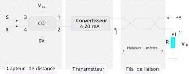

## Overview

This TikZ graphic illustrates a **4–20 mA current loop**, a standard signal transmission method widely used in industrial instrumentation.

The diagram represents the connection between a sensor, transmitter, transmission loop, and receiving circuit.

## Graphic

::: {.figure-container}

{width="100%" fig-alt="4–20 mA current loop TikZ diagram for industrial instrumentation"}

:::

## Description

The figure illustrates the main elements of a typical **4–20 mA measurement chain**:

- sensor;
- transmitter;
- current-loop transmission;
- electrical connections;
- receiving resistor;
- measurement or display system.

The 4–20 mA standard is commonly used in industrial environments because current transmission provides good robustness against voltage drops and electrical noise.

## Resources

[Download PDF](../resources/tikz/pdf/current-loop-4-20ma.pdf){.btn .btn-primary}

[Download LaTeX Source](../resources/tikz/latex/current-loop-4-20ma.tex){.btn .btn-outline-primary}

## Topics

`TikZ` · `LaTeX` · `4–20 mA` · `Sensors` · `Instrumentation` · `Industrial Electronics`